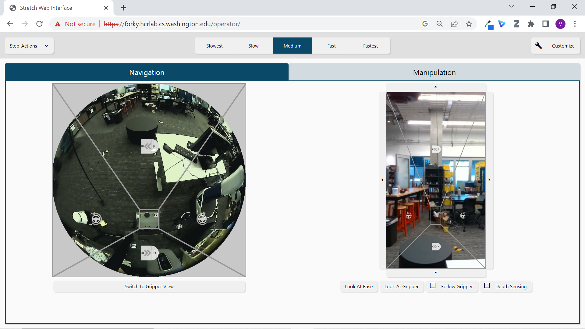
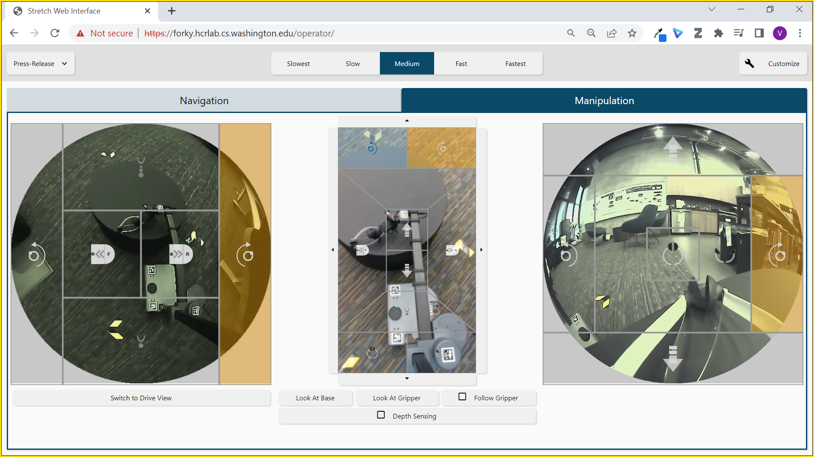
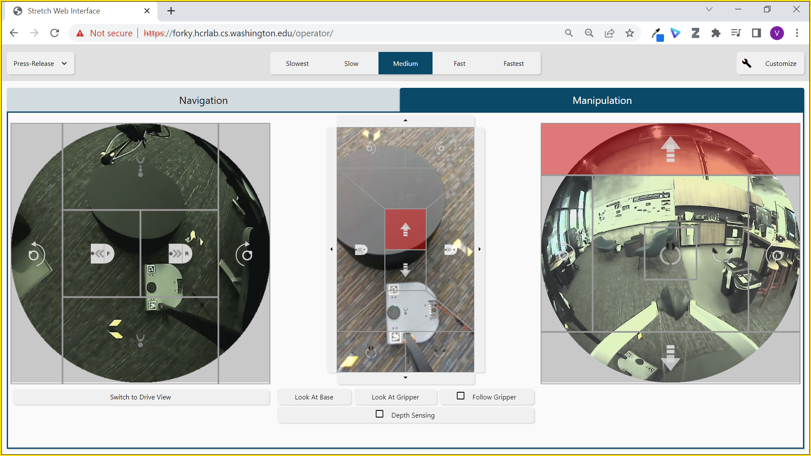

# Interace Usage Tutorial 
The web interface currently has a variety of control modes, displays and customization options. This tutorial will go through how to use the various components of the interface.

## Overview of Layout
We have a variety of layouts that you can load. We will start by exploring one of the layouts and how to can customize it to your liking.

There are two tabs: `Navigation` and `Manipulation`. The `Navigation` tab has a overhead video stream from a fish eye camera and a video stream from a Realsense camera. The `Manipulation` tab has the same video streams from as the `Navigation` tab and an additional video stream from a fish eye camera mounted on the gripper. The overhead fish eye video stream in the `Manipulation` tab is cropped and rotated to focus on the arm and gripper.

| Navigation Tab                           | Manipulation Tab                             | 
|----------------------------------------- | -------------------------------------------- |
|  |  |

## Button Pads

All the video streams have `button pads` overlaid on the video streams. These buttons control different joints on the robot. Each video stream has its own distinct button pad. To modify the button pads, click the `Customize` button select one of the `button pads` on a video stream and click the trash icon. Then select a new `button pad` that you want to add from the `button pad` drop down in the customize menu. Then select the video stream you want to place it on. 

    

You can also move button pads outside of the video stream by selecting one of the regions to the side of the stream. 

    

## Action Modes
There are three different `action modes`: Step Actions, Press-Release and Click-Click. You can select one of 5 discrete speeds: `Slowest`, `Slow`, `Medium`, `Fast`, and `Fastest`. When you click a button, it will turn red to indicate that Stretch is moving.

### Step Actions
When you click, Stretch will move a fixed distance based on the selected speed.

    

### Press-Release
Stretch will move while you are pressing and holding the button and will stop when you release.

    

### Click-Click
Stretch will start moving when you click and will stop when you click again. You can also stop Stretch by moving the cursor outside the button you clicked.

    

## Predictive Display 
The overhead fish eye video stream has an additional mode called `predictive display`. This mode will overlay a trajectory over the video stream that Stretch will follow. Stretch's speed and heading will depend on the length and curve of the trajectory. Stretch will move faster when the trajectory the longer the trajectory is. The trajectory will turn red when the robot is moving. The robot will rotate in place when you click on the base and will move backwards when you click behind the base. In the `press-release` and `click-click` modes you can move the cursor to update the trajectory while the robot is moving. Additionally, you can scale the speed by selecting one of the speed controls. The video below demonstrates using `predictive display` in the `press-release` mode, however, you can use any of the action modes for `predictive display`. 

    

## Collision and Joint Limits
| The button turns orange when the respectivate joint is in collision | The button turns red when the respectivate joint is a its limit | 
|-------------------------------------------------------------------- | --------------------------------------------------------------- |
|                                   |                                 |

## Changing Camera Views
You can change the camera direction for both the overhead fish eye and realsense cameras:
<ul>
    <li>Switch to Drive View: The overhead fisheye camera will focus on the Stretch's. This is benefitial when driving around.</li>
    <li>Switch to Gripper View: The overhead fisheye camera will focus on the Stretch's arm and gripper. This is benefitial when trying to pick something up.</li>
    <li>Look at Base: The realsense camera will move to look at Stretch's base. This is benefitial when driving around.</li>
    <li>Look at Gripper: The realsense camera will move to look at Stretch's arm. This is benefitial when trying to pick something up.</li>
</ul>

    

## Follow Gripper
The `follow gripper` button will automatically move the realsense to focus on the gripper as the arm is moved. This is can be useful when trying to pick something up.

    

## Depth Sensing
The `depth sensing` button will highlight points that are in the Stretch's reach in blue. This can be useful when trying to pick something up.

    

## Pan/Tilt Realsense Camera
You can pan and tilt the realsense camera by clicking the buttons bordering the realsense video stream.

    

## Button Grid and Joystick
You can add a `button grid` and `joystick` from the customize menu similar to the way you would add a button pad. The `button grid` is similar to the `button pad` but is separated by the different sets of joints you can control. The `joystick` is similar to how you would drive the robot if you were controlling it with a remote controller's joystick.

    

## Adding/Deleting Panels and Tabs
A `panel` contains a set of `tabs`; each `tab` contains a `layout` that you can define by adding different components such as camera views, button pads, etc. 

### Panels
You can add and delete panels. When you add a new `panel`, you must enter a name for a `tab` in that `panel`.

    

### Tabs
You can add and delete tabs. Click the tab with the plus icon to add a `tab`. You will then be prompted to name the `tab` and can add components in that tab. To delete the `tab`, select it and click the trash icon.

    

## Voice Commands
You can control Stretch with voice commands. Click the info icon to see the available commands. Click the microphone icon to turn on the microphone. After you say a command, the command will display next to microphone icon. Click the microphone icon to turn off the microphone.

    

## Load/Save Layouts
We have pre-defined layouts that you can load. You can also save your layout and load it later.