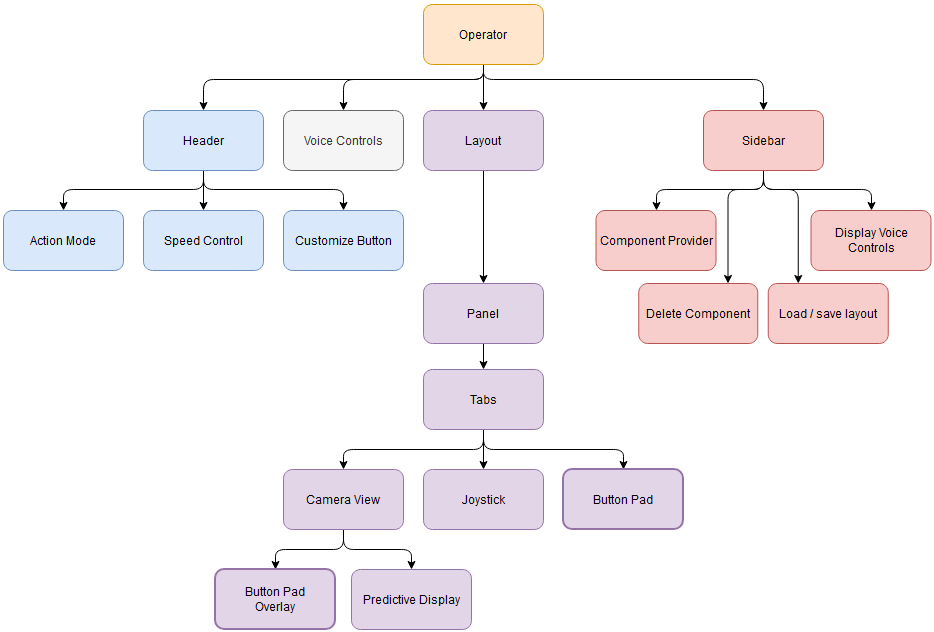
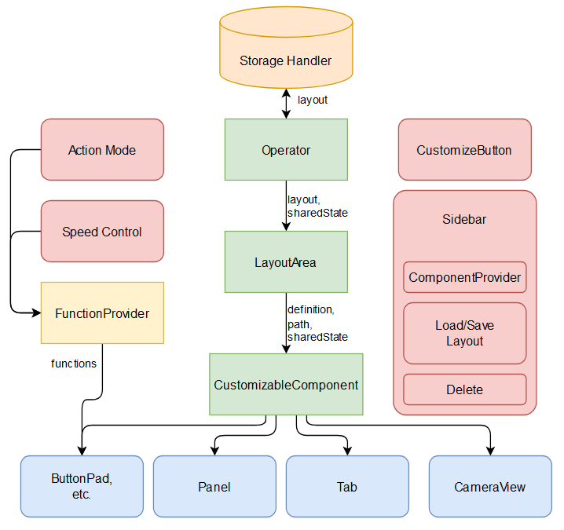

# Operator Page

The operator page is what users see while teleoperating the robot.

For more info on the directory file structure see [documentation here](./tsx/README.md).

## Operator Page


## Component Hiearchy

Below is a diagram showing the hiearchy between components in the operator page.



* Header
: fixed at the top of the screen, this displays controls that the user always has access to
    * Action Mode
    : dropdown on the left of the header to switch between step-actions, press-release, and click-click action modes
    * Speed Control
    : Set of buttons labeled from "slowest" to "fastest" which control the scaling of the robots speed for all joints and all controls
    * Customize button
    : button on the right side of the header which enters/leaves customization mode

* Voice Controls 
: component below the header and above the layout, allows the user to activate a microphone with voice controls of the interface

* Sidebar
: the vertical menu on the right side of the page which is only displayed while in customize mode. The top of the sidebar shows the currently selected element, or "none" if nothing is selected.
    * Component Provider
    : visible when no elements are selected from the layout, this is the upper area in the Sidebar which allows users to choose an element to add into the layout
    * Display voice controls
    : option to display or hide the voice controls

* Layout
: the area where the user has control over the elements inside. The user can add, remove, or modify elements in the layout
    * Panel
    : a component which contains one or more tabs
    * Tab
    : a component which contains one or more controls or camera views
        * Camera view
        : a video element showing a live stream from one of the robot's cameras
            * Predictive display
            : a special control which can only be placed over the overhead camera view. It draws a curve from the base to the cursor showing the path the robot will take if the user clicks at a location on the camera view.
        * Joystick
        : a virtual joystick which can be used to control the base
        * Button Pad
        : a set of buttons which can be placed independently or over a camera view
        
## Layout

Here's a simple example of a layout:

```ts
import { LayoutDefinition, ComponentType, ActionMode, CameraViewId, ButtonPadId, OverheadVideoStreamDef, TabDefinition, PanelDefinition } from "/utils/component_definitions";

export const SIMPLE_LAYOUT: LayoutDefinition = {
    // All components have a type
    type: ComponentType.Layout,
    // If voice control should be displayed on the operator page
    displayVoiceControl: false,
    // The state of the action mode dropdown
    actionMode: ActionMode.StepActions,

    // The customizable components in the layout
    children: [
        {
            // The layout contains a single panel
            type: ComponentType.Panel,
            children: [
                {
                    // The panel contains a single tab
                    type: ComponentType.SingleTab,
                    // The title of the tab is "Tab One"
                    label: 'Tab One',
                    children: [
                        {
                            // Tab contains a single camera view
                            type: ComponentType.CameraView,
                            // From the Stretch overhead camera
                            id: CameraViewId.overhead,
                            children: [
                                {
                                    // Camera view has a button pad overlay
                                    type: ComponentType.ButtonPad,
                                    // Button pad to control the base 
                                    id: ButtonPadId.Drive
                                }
                            ]
                        } as OverheadVideoStreamDef
                    ]
                } as TabDefinition
            ]
        } as PanelDefinition
    ]
}
```

The layout is an object containing a set of nested `ComponentDefinitions`, where each `ComponentDefinition` represents the details for a `CustomizableComponent` to render.

The predefined default layouts can be found in `./tsx/default_layouts/`.

All of the definitions for the different component definitions can be found in `./tsx/utils/component_definitions.tsx`

## Render Logic Flow

This diagram shows the flow of logic between classes and components while the Operator Page renders.



**`StorageHandler`**
: When the `Operator` first renders, it gets the `layout` from the `StorageHandler` (to preserve state between page reloads). Whenever the user changes the `layout`, `Operator` will save the updated state with `StorageHandler`.

**`Operator`**
: creates a `sharedState` object with relevant information for all components in the layout, then passes the `layout` and `sharedState` to the `LayoutArea`.

**`LayoutArea`**
:  corresponds to "Layout" in the Component Hiearchy. This renders the individual components in the layout, with `DropZone`'s in between so that components can be moved in customize mode.

**`CustomizableComponent`**
: a single component in the layout, the customizable component renders a different subcomponent based on the `type` in the `ComponentDefinition`.

**`FunctionProvider`**
: takes the action mode and speed control from `ActionMode` and `SpeedControl` respectively. Returns a set of functions for how different controls should behave, for example `onClick` and `onRelease` for a button on a `ButtonPad`.

**`ButtonPad` and other controls**
: when `ButtonPad` or another control renders, it gets the set of functions from the `FunctionProvider`.